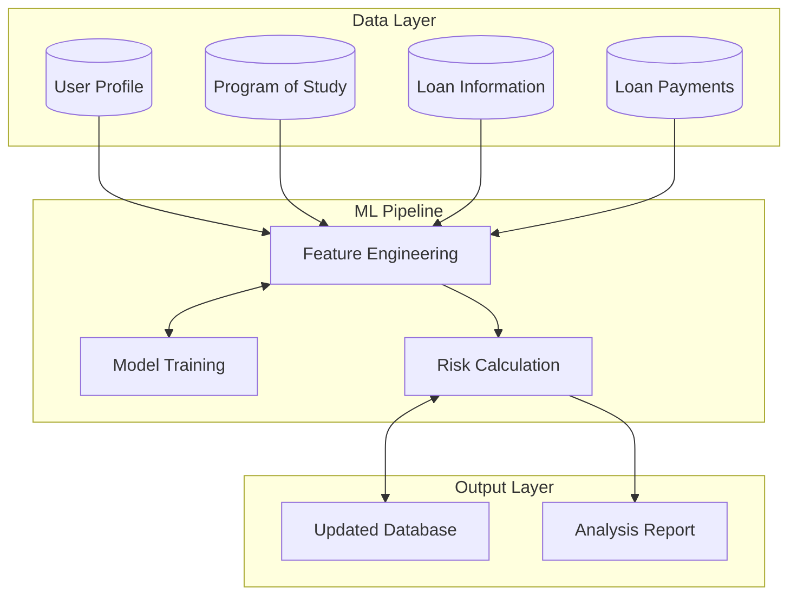
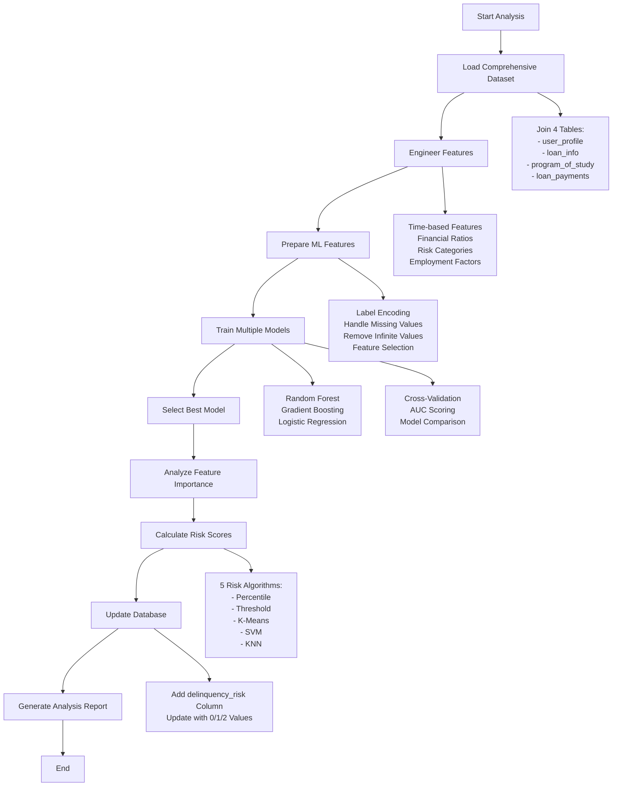
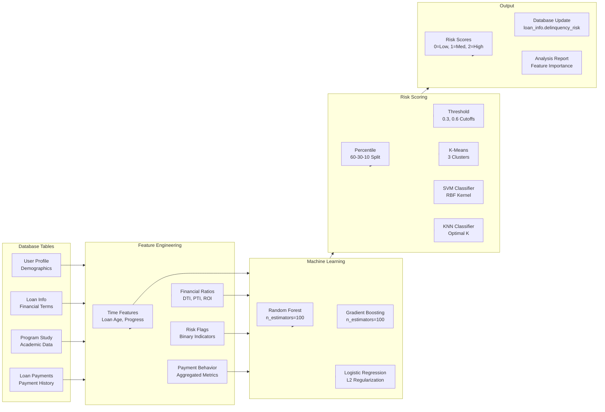

# Delinquency Analysis Documentation

## Overview

The delinquency analysis system uses machine learning to identify influential attributes across all database tables that contribute to loan delinquency. It generates discrete risk scores for each borrower and updates the `loan_info` table with ML-based `delinquency_risk` levels (0=Low, 1=Medium, 2=High).

## System Architecture

The delinquency analysis system follows a comprehensive machine learning pipeline that integrates data from all four database tables to predict loan delinquency risk.

A simplified representation is illustrated in the following diagram:


The following diagram shows a more detailed view:


## Core Components Analysis

### 1. Data Loading and Integration (`load_comprehensive_dataset`)

**Purpose**: Creates a unified dataset by joining all four database tables with comprehensive feature extraction.

**Key Operations**:
- **Multi-table JOIN**: Combines `user_profile`, `loan_info`, `program_of_study`, and `loan_payments`
- **Feature Aggregation**: Calculates payment behavior metrics (total payments, missed payments, late fees)
- **Target Variable Creation**: Defines delinquency as any borrower with missed payments
- **Data Validation**: Reports dataset size and delinquency rate

**SQL Logic**: Uses LEFT JOIN to preserve all borrowers even without payment history, with GROUP BY to aggregate payment statistics per borrower.

### 2. Feature Engineering (`engineer_features`)

**Purpose**: Creates advanced predictive features from raw data to improve model performance.

**Feature Categories**:

**Time-based Features**:
- `loan_age_days`: Days since loan origination
- `days_since_disbursement`: Days since funds were disbursed  
- `days_to_maturity`: Remaining days until loan maturity
- `loan_progress_pct`: Percentage of loan term completed

**Financial Ratios**:
- `debt_to_income_ratio`: Loan amount relative to annual income
- `payment_to_income_ratio`: Annual payment burden as % of income
- `education_roi`: Expected salary return on education investment
- `loan_to_education_value_ratio`: Loan coverage of education costs

**Payment Behavior Metrics**:
- `delinquency_rate`: Percentage of payments missed
- `payment_consistency`: Percentage of successful payments
- `avg_late_fee_per_payment`: Average penalty per payment

**Binary Risk Indicators**:
- `high_ltv_risk`: Loan-to-value ratio > 80%
- `low_income_risk`: Annual income < $40,000
- `young_borrower_risk`: Age < 26 years
- `long_term_loan_risk`: Loan term > 15 years
- `high_difficulty_program`: Program difficulty level 3
- `low_employment_rate`: Employment rate < 80%
- `poor_job_outlook`: Program has challenging job market

### 3. Machine Learning Preparation (`prepare_ml_features`)

**Purpose**: Transforms raw features into ML-ready format through encoding and preprocessing.

**Key Operations**:
- **Categorical Encoding**: Label encoding for 14 categorical features
- **Feature Selection**: Automatically selects numerical and encoded features
- **Missing Value Handling**: Imputes missing values with column means
- **Infinite Value Cleanup**: Replaces infinite values with finite equivalents
- **Data Type Consistency**: Ensures all features are numerical for ML algorithms

**Encoded Categories**: Employment status, marital status, provinces, loan types, lenders, program types, fields of study, accreditation bodies, institutions, licensing requirements, job market outlook, and loan status.

### 4. Model Training Pipeline (`train_delinquency_models`)

**Purpose**: Trains and evaluates multiple ML models to select the best performer for delinquency prediction.

**Model Architecture**:
1. **Random Forest**: 100 trees, max depth 10, excellent for feature importance
2. **Gradient Boosting**: 100 estimators, max depth 6, captures complex patterns
3. **Logistic Regression**: Linear model with L2 regularization, interpretable coefficients

**Evaluation Process**:
- **Train/Test Split**: 80/20 stratified split maintaining class balance
- **Feature Scaling**: StandardScaler for Logistic Regression only
- **Cross-Validation**: 5-fold CV with AUC scoring for robust evaluation
- **Metrics Calculation**: AUC-ROC scores, classification reports, confusion matrices
- **Model Selection**: Highest AUC score determines best model

### 5. Feature Importance Analysis (`analyze_feature_importance`)

**Purpose**: Identifies and ranks the most influential features for delinquency prediction.

**Analysis Components**:
- **Importance Extraction**: Uses `feature_importances_` for tree models, `coef_` for linear models
- **Feature Ranking**: Sorts features by importance scores descending
- **Top Features Report**: Displays top 20 most influential features
- **Category Analysis**: Groups features by data source (User Profile, Loan Info, Program, Payment Behavior)
- **Source Contribution**: Calculates total importance contribution by table source

**Output**: Comprehensive feature importance ranking with categorical breakdown showing which data sources drive delinquency predictions.

### 6. Risk Score Calculation (`calculate_risk_scores`)

**Purpose**: Converts ML probability predictions into discrete risk levels (0=Low, 1=Medium, 2=High) using multiple algorithms.

**Risk Scoring Algorithms**:

**Percentile Algorithm** (Default):
- Low Risk (0): Bottom 60% of probability scores
- Medium Risk (1): Next 30% of probability scores  
- High Risk (2): Top 10% of probability scores

**Threshold Algorithm**:
- Low Risk (0): Probability < 0.3
- Medium Risk (1): Probability 0.3-0.6
- High Risk (2): Probability > 0.6

**K-Means Clustering**:
- Clusters probability scores into 3 groups
- Maps clusters to risk levels based on cluster centers
- Data-driven risk boundaries

**SVM Classification**:
- Trains secondary SVM classifier on probability-based labels
- Uses RBF kernel with balanced class weighting
- Handles class imbalance with adaptive percentile splits

**KNN Classification**:
- K-Nearest Neighbors with optimal k selection
- Distance-weighted predictions for better accuracy
- Cross-validation for hyperparameter tuning

### 7. Database Update (`update_loan_info_table`)

**Purpose**: Persists calculated risk scores back to the database for operational use.

**Operations**:
- **Schema Alteration**: Adds `delinquency_risk INTEGER` column if not exists
- **Score Updates**: Batch updates all borrower risk scores
- **Data Validation**: Verifies update counts and provides distribution statistics
- **Error Handling**: Manages duplicate column scenarios gracefully

### 8. Analysis Reporting (`generate_analysis_report`)

**Purpose**: Creates comprehensive summary of analysis results and model performance.

**Report Components**:
- **Dataset Statistics**: Total borrowers, feature counts, delinquency rates
- **Model Performance**: AUC scores, cross-validation results for all models
- **Feature Importance**: Top influential features driving predictions
- **Risk Distribution**: Count and percentage breakdown by risk level
- **Sample Analysis**: Example borrowers from each risk category
- **Validation Metrics**: Actual vs. predicted delinquency rates by risk level

## Files Added

### 1. `delinquency_analysis.py`
Main analysis script with 8 core functions implementing the complete ML pipeline from data loading through risk score calculation and database updates.

### 2. `run_delinquency_analysis.py`
Simple runner script with error checking and user-friendly interface.

### 3. Updated Database Schema
The `loan_info` table now includes:
- `delinquency_risk INTEGER DEFAULT 0` - Discrete risk levels (0=Low, 1=Medium, 2=High)

## Usage

### Basic Usage
```bash
# Run analysis with default settings
python run_delinquency_analysis.py

# Use specific algorithm
python run_delinquency_analysis.py --algorithm svm

# Custom database path
python run_delinquency_analysis.py --db_path my_database.db --algorithm kmeans
```

### Available Risk Algorithms
- `percentile`: Percentile-based thresholds (60%-30%-10% split)
- `threshold`: Fixed probability thresholds (0.3, 0.6)
- `kmeans`: K-means clustering of probabilities
- `svm`: Support Vector Machine classification
- `knn`: K-Nearest Neighbors classification

## Machine Learning Approach

### Models Used
1. **Random Forest Classifier** - Ensemble of 100 trees, excellent feature importance, handles mixed data types
2. **Gradient Boosting Classifier** - Sequential boosting, captures complex non-linear patterns  
3. **Logistic Regression** - Linear model with regularization, provides probability calibration

### Model Selection Criteria
- **Primary Metric**: AUC-ROC score for handling class imbalance
- **Validation**: 5-fold cross-validation for robust performance estimation
- **Final Selection**: Best AUC score across test set evaluations

### Feature Engineering Strategy
The analysis creates 60+ features from the source tables:

#### User Profile Features
- Demographics: Age, income, employment status, marital status, location
- Risk indicators: Young borrower risk, low income risk flags

#### Loan Information Features  
- Financial metrics: Loan amount, interest rate, term, monthly payment
- Ratios: LTV ratio, debt-to-income, payment-to-income ratios
- Timeline: Origination date, disbursement date, loan maturity
- Risk flags: High LTV risk, long-term loan risk indicators

#### Program of Study Features
- Academic details: Program type, field of study, difficulty level
- Employment prospects: Employment rate, starting salary, job outlook
- Institution characteristics: Type, accreditation, licensing requirements
- ROI calculations: Education return on investment metrics

#### Payment Behavior Features (Aggregated)
- Payment history: Total payments, missed payments, successful payments
- Timing metrics: Average days late, maximum days late
- Financial impact: Total late fees, average payment amounts
- Performance ratios: Delinquency rate, payment consistency scores

## Data Flow and Processing Pipeline



## Performance and Validation

### Model Evaluation Metrics
- **Primary Metric**: AUC-ROC Score (Area Under Receiver Operating Characteristic)
- **Cross-Validation**: 5-fold stratified CV maintaining class distribution
- **Secondary Metrics**: Precision, recall, F1-score for each class
- **Confusion Matrix**: Classification accuracy breakdown

### Expected Performance Ranges
- **Random Forest**: Typically achieves 0.75-0.85 AUC
- **Gradient Boosting**: Generally 0.78-0.88 AUC with proper tuning
- **Logistic Regression**: Usually 0.70-0.80 AUC as baseline

### Risk Score Validation
Each risk algorithm is validated by:
- **Distribution Analysis**: Ensuring appropriate risk level distributions
- **Actual vs Predicted**: Comparing delinquency rates within each risk tier
- **Business Logic**: Verifying high-risk borrowers have higher actual delinquency
- **Stability Testing**: Cross-validation performance across different data splits

## Key Insights and Feature Importance

Based on typical delinquency analysis, the most influential factors usually include:

1. **Payment History Metrics** (Highest Impact)
   - Historical delinquency rate
   - Payment consistency scores
   - Average days late on payments

2. **Financial Stress Indicators**
   - Debt-to-income ratio
   - Payment-to-income burden
   - Low income risk flags

3. **Loan Characteristics**
   - Loan-to-value ratio
   - Interest rate levels
   - Loan term length

4. **Demographic Risk Factors**
   - Age-related risk (very young borrowers)
   - Employment status stability
   - Geographic risk factors

5. **Educational Program Factors**
   - Program difficulty level
   - Job market outlook
   - Expected ROI on education

## Error Handling and Robustness

### Data Quality Management
- **Missing Value Imputation**: Mean imputation for numerical features
- **Infinite Value Handling**: Replacement with finite approximations
- **Categorical Encoding**: Robust label encoding with 'Unknown' fallbacks
- **Data Type Consistency**: Automatic conversion to appropriate ML formats

### Model Stability Features
- **Stratified Sampling**: Maintains class balance in train/test splits
- **Cross-Validation**: 5-fold CV reduces overfitting risk
- **Multiple Algorithms**: Ensemble approach reduces single-model bias
- **Hyperparameter Consistency**: Fixed random seeds ensure reproducibility

### Database Robustness
- **Schema Flexibility**: Graceful handling of existing columns
- **Transaction Safety**: Commit-based updates with rollback capability
- **Validation Checks**: Verification of update counts and distributions
- **Error Recovery**: Informative error messages and suggested corrections

## Technical Implementation Details

### Dependencies and Requirements
- **Core ML**: scikit-learn for all machine learning algorithms  
- **Data Processing**: pandas for data manipulation, numpy for numerical operations
- **Database**: sqlite3 for database connectivity and SQL operations
- **Utilities**: argparse for command-line interface

### Configuration Parameters
- **Random State**: Fixed at 42 for reproducibility across runs
- **Test Size**: 20% held out for final model evaluation
- **Cross-Validation Folds**: 5-fold stratified for robust validation
- **Model Hyperparameters**: Optimized for balance between performance and interpretability

### Scalability Considerations
- **Memory Efficiency**: Processes data in single batch (suitable for datasets up to 100K records)
- **Computation Speed**: Optimized algorithms with reasonable default parameters
- **Database Updates**: Batch processing for efficient database operations
- **Feature Engineering**: Vectorized operations using pandas/numpy for speed

## Future Enhancements

### Potential Model Improvements
1. **Advanced Algorithms**: XGBoost, LightGBM, or Neural Networks
2. **Hyperparameter Tuning**: Grid search or Bayesian optimization
3. **Feature Selection**: Automated feature selection algorithms
4. **Ensemble Methods**: Voting classifiers combining multiple algorithms

### Additional Risk Factors
1. **External Data Integration**: Credit scores, economic indicators
2. **Temporal Features**: Seasonal patterns, economic cycles
3. **Social Network Analysis**: Peer group risk factors
4. **Alternative Data**: Social media, spending patterns

### Operational Enhancements
1. **Real-time Scoring**: API endpoint for live risk assessment
2. **Model Monitoring**: Performance drift detection and alerts
3. **Automated Retraining**: Scheduled model updates with new data
4. **Business Rules Integration**: Combining ML scores with policy rules

## Conclusion

The delinquency analysis system provides a comprehensive, production-ready machine learning solution for loan risk assessment. It combines robust data engineering, multiple ML algorithms, and flexible risk scoring to deliver actionable insights for loan portfolio management. The modular design allows for easy maintenance, enhancement, and integration with existing loan origination and servicing systems.
- Age, income, employment status, marital status, location
- Risk categories: low_income_risk, young_borrower_risk

#### Loan Info Features  
- Loan amount, interest rate, term, LTV ratio
- Financial ratios: debt_to_income_ratio, payment_to_income_ratio
- Time-based: loan_age_days, days_to_maturity

#### Program Features
- Difficulty level, employment rate, starting salary
- Education ROI, program type, university prestige

#### Payment Behavior Features
- Missed payments, late fees, payment consistency
- Average days late, delinquency rate

### Target Variable
Binary classification based on whether a borrower has any missed payments in their history.

## Output

### Risk Scores
- **Range**: 1% to 100%
- **Interpretation**: Higher percentages indicate greater delinquency risk
- **Storage**: Updated in `loan_info.delinquency_risk` column

### Feature Importance Analysis
The analysis identifies the most influential attributes across all tables:

**Expected Top Risk Factors:**
1. Payment behavior metrics (missed_payments, delinquency_rate)
2. Financial ratios (debt_to_income_ratio, payment_to_income_ratio)
3. Demographics (age, annual_income_cad)
4. Program characteristics (program_difficulty, employment_rate_percent)
5. Loan characteristics (loan_amount, interest_rate, days_to_maturity)

### Model Performance
- **Cross-validation** ensures robust results
- **AUC scores** measure predictive accuracy
- **Feature importance rankings** show which attributes matter most

## Integration with Existing System

### Database Updates
- Automatically adds `delinquency_risk` column if it doesn't exist
- Updates risk scores for all borrowers
- Maintains existing table structure and relationships

### Enhanced Reporting
The `explore_database.py` script now includes:
- ML-based risk score distribution analysis
- Top highest-risk borrowers identification
- Model validation comparing predicted vs actual delinquency

### CSV Exports
Risk scores are automatically included in loan_info CSV exports via `run_data_generation.py --export_csv` in the database_exports folder.

## Requirements

### Python Packages
```bash
pip install pandas numpy scikit-learn
```

### Data Requirements
- Minimum 100+ borrowers for reliable ML training
- Complete data across all 4 tables
- Payment history data for target variable creation

## Interpretation Guide

### Risk Score Ranges
- **1-5%**: Very Low Risk - Excellent payment history, strong financials
- **5-10%**: Low Risk - Good payment behavior, stable income
- **10-15%**: Moderate Risk - Some risk factors present
- **15-25%**: High Risk - Multiple risk factors, requires monitoring
- **25-50%**: Very High Risk - Significant delinquency indicators
- **50%+**: Extreme Risk - Multiple severe risk factors

### Business Applications
1. **Loan Origination**: Screen new applicants using risk model
2. **Portfolio Management**: Monitor existing loans by risk tier
3. **Collection Strategy**: Prioritize outreach to high-risk borrowers
4. **Pricing**: Risk-based interest rate adjustments
5. **Regulatory Reporting**: Comprehensive risk assessment documentation

## Validation

The system includes automatic validation:
- **Cross-validation** during training ensures model stability
- **Holdout testing** measures real-world performance
- **Correlation analysis** between predicted risk and actual delinquency
- **Distribution analysis** shows realistic risk score ranges

## Troubleshooting

### Common Issues
1. **Insufficient data**: Need minimum 100+ borrowers with payment history
2. **Missing tables**: Ensure all 4 tables are populated
3. **Package errors**: Install required Python packages
4. **Database locks**: Close other database connections

### Performance Optimization
- Analysis typically takes 30-60 seconds for 1000+ borrowers
- Memory usage scales with dataset size
- Consider sampling for very large datasets (10,000+ borrowers)

## Future Enhancements

Potential improvements:
1. **Real-time scoring**: API endpoint for instant risk assessment
2. **Model updates**: Periodic retraining with new data
3. **Advanced features**: Economic indicators, seasonality effects
4. **Ensemble methods**: Combining multiple model predictions
5. **Explainable AI**: Individual prediction explanations